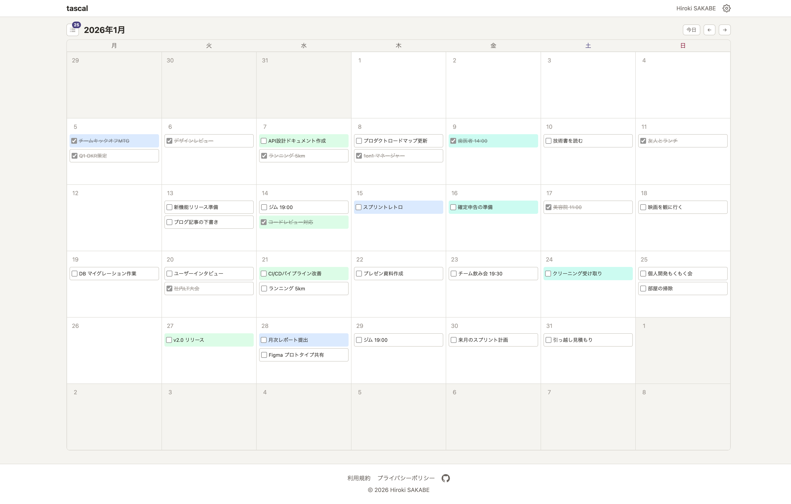

<div align="center">

# tascal

### タスク管理を、カレンダーから。

シンプルなカレンダー UI でタスクを俯瞰・整理できるタスク管理アプリ

[Web アプリ](https://tascal.dev/) | [CLI](https://www.npmjs.com/package/tascal-cli)

</div>

<br />

<div align="center">



</div>

<br />

## はじめる

### Web アプリ

[tascal.dev](https://tascal.dev/) にアクセスしてアカウントを作成するだけで、すぐに使い始められます。

### CLI

```bash
npm install -g tascal-cli
```

```bash
tascal login               # ログイン
tascal logout              # ログアウト
tascal list                # タスク一覧
tascal add                 # タスク作成
tascal edit <id>           # 編集
tascal done <id>           # 完了にする
tascal undo <id>           # 未完了に戻す
tascal delete <id>         # 削除
tascal category list       # カテゴリ一覧
tascal category add        # カテゴリ作成
tascal category edit <id>  # カテゴリ編集
tascal category delete <id>  # カテゴリ削除
```

